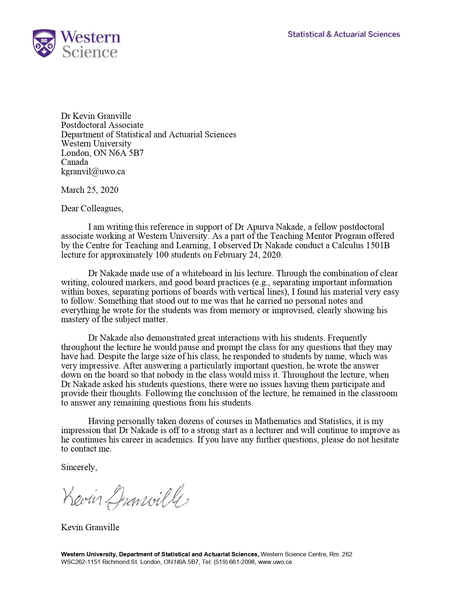
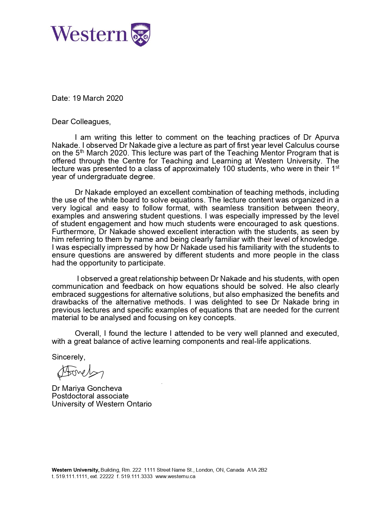
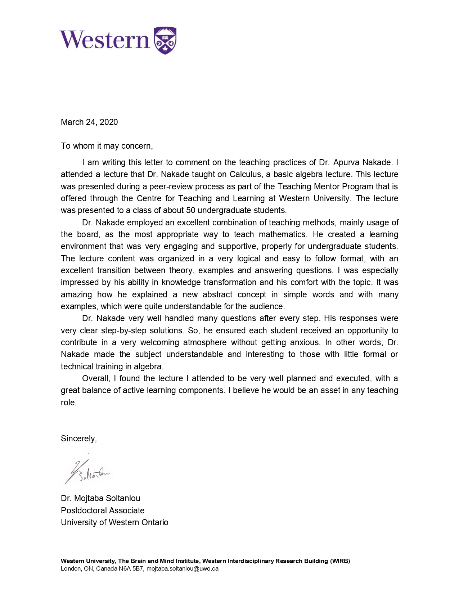

# Teaching Evaluations

## Student Evaluations

The following table lists *median* scores for the questions of **Instructor Effectiveness** and **Course Experience** from end-of-course student evaluations. Detailed student responses can be found here: https://github.com/apurvnakade/PDFs/tree/main/teaching%20evaluations

|             |                                                   | Instructor | Course |
| ----------- | ------------------------------------------------- | ---------- | ------ |
| 2022 Spring | Introduction to Optimization                      | 6/6        | 6/6    |
| 2022 Spring | MENU Linear Algebra and Multivariable Calculus    | 6/6        | 5/6    |
| 2022 Winter | MENU Linear Algebra and Multivariable Calculus    | 6/6        | 5/6    |
| 2021 Fall   | MENU Linear Algebra and Multivariable Calculus    | 6/6        | 6/6    |
| 2021 Fall   | Single Variable Calculus (coordinated)            | 5/6        | 4/6    |
| 2020 Fall   | Discrete Structures for Engineering               | 7/7        | 7/7    |
| 2019 Fall   | Calculus I for Mathematical and Physical Sciences | 6/7        | 6/7    |
| 2018 Fall   | Honors Single Variable Calculus                   | 5/5        | 4/5    |
| 2017 Summer | Differential Equations with Applications          | 5/5        | 4/5    |
| 2015 Summer | Differential Equations with Applications          | 4/5        | 4/5    |
| 2014 Summer | Online Linear Algebra                             | 3/5        | 3/5    |

### Selected Student Feedback

- This[Optimization] was the best math class I've taken so far at Northwestern. For the first time, I feel like I will carry the material I learned in class
for years and years, as it's so applicative to real world problems. 
- Optimization is a really useful and practical math course that all math majors should take. It isn't very proof-heavy and focuses
more on computation.    
- Apurva is phenomenal! He broke down key concepts with ease, and homework questions went over a variety of different examples.
Optimization is interesting as a whole due to it wide applicability in other fields, but I felt this was an enjoyable course because of
Apurva
- Dr. Nakade is the best teacher for second-year software engineering. Your recorded lectures are very clear and make me happy as I
actually understand after watching them. You seem like a very hard-working professor that truly cares about their students. Thank you!
The zybook and PA and CA are just perfect for making me on-track. I'm never behind in this class because of the PA and CA.
- The PAs and CAs are helpful and
fun and an interactive way that helps me learn the concepts better. I like that I am not punished for when I get an answer incorrect and
am instead presented with the solution so I can better understand it while learning. The webworks assessments are also a good and
fair evaluation of my understanding 
(Also, thank you for not using Proctortrack because the idea of it really stresses me out.)
- The use of ZyBooks to teach discrete math was an absolute genius move, as the online textbook paired with the instructor videos were
extremely clear in explaining and testing knowledge of mathematical concepts. I recommend using it for future years
- Apurva is the best Professor. Though his lecture notes can have minor mistakes, he is a very nice guy and you can ask him
questions without being intimidated. His office hours are very helpful and talking to him about non–math things are also a lot of fun.
- Professor Nakade is so kind and enthusiastic about helping his students learn. This quarter of MENU was definitely challenging
(like the other two), but there is a strong system of support from office hours and studying with MENU friends that makes the course
doable. 
- Apurva is very encouraging when you are struggling with a problem and you can really tell that he was excited about math and
teaching!        
- He is really passionate about the subject and explains things well. He is very funny and approachable in class, and he gives a lot of
opportunities for students to ``check their understanding" by participating in class, working through problems as a class, etc. He
also would always stay after class for questions if anyone had any.

## Peer Evaluations
  In Winter 2020, I participated in the Teaching Mentor Program at UWO.
  The Teaching Mentor Program is a cohort-based hands-on learning experience, wherein participants
  work with a group of 4-5 interdisciplinary graduate students and postdoctoral scholars to observe
  and offer feedback on one another's teaching. Groups will meet multiple times over the course of
  the semester, to act as students in one another’s teaching demonstrations. My group had four
  participants whose feedbacks are attached here.

  
  
  